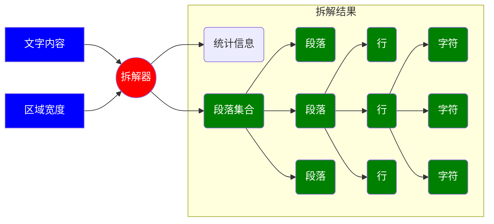
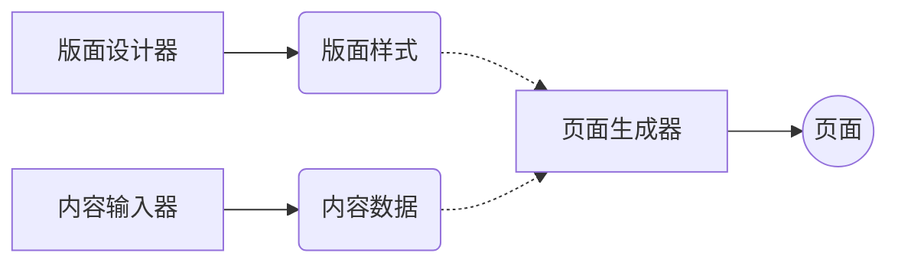
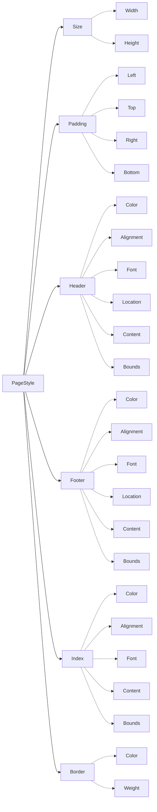

# 技术方案

## 技术难点

* 世系图生成算法
* 分页算法
* 版面设计器
* 页面生成器

## 文字内容拆解

```mermaid
graph LR
TextContent[文字内容]-->TextDisassembly((拆解器))
AreaWidth[区域宽度]-->TextDisassembly

subgraph 拆解结果
	CountInfo(统计信息)
	Paragraphs(段落集合)
	Paragraph1(段落)
	Paragraph2(段落)
	Paragraph3(段落)
	Line1(行)
	Line2(行)
	Line3(行)
	Char1(字符)
	Char2(字符)
	Char3(字符)
end

Paragraphs-->Paragraph1
Paragraphs-->Paragraph2
Paragraphs-->Paragraph3

Paragraph2-->Line1
Paragraph2-->Line2
Paragraph2-->Line3

Line2-->Char1
Line2-->Char2
Line2-->Char3

TextDisassembly-->CountInfo
TextDisassembly-->Paragraphs

classDef red fill:red,color:white
classDef blue fill:blue,color:white
classDef green fill:green,color:white

class TextDisassembly red
class TextContent,AreaWidth blue
class Paragraphs,Paragraph1,Paragraph2,Paragraph3,Line1,Line2,Line3,Char1,Char2,Char3 green
```

## 思路

```mermaid
graph LR
PageStyleDesigner[版面设计器]-->PageStyle(版面样式)-.->PageGenerator[页面生成器]
ContentInput[内容输入器]-->PageContent(内容数据)-.->PageGenerator
PageGenerator-->Page((页面))
```

## 数据结构

```mermaid
graph LR
PageStyle-->Size
Size-.->Width
Size-.->Height

PageStyle-->Padding
Padding-.->Left
Padding-.->Top
Padding-.->Right
Padding-.->Bottom

PageStyle-->Header
Header-.->Header_Color[Color]
Header-.->Header_Alignment[Alignment]
Header-.->Header_Font[Font]
Header-.->Header_Location[Location]
Header-.->Header_Content[Content]
Header-.->Header_Bounds[Bounds]

PageStyle-->Footer
Footer-.->Footer_Color[Color]
Footer-.->Footer_Alignment[Alignment]
Footer-.->Footer_Font[Font]
Footer-.->Footer_Location[Location]
Footer-.->Footer_Content[Content]
Footer-.->Footer_Bounds[Bounds]

PageStyle-->Index
Index-.->Index_Color[Color]
Index-.->Index_Alignment[Alignment]
Index-.->Index_Font[Font]
Index-.->Index_Content[Content]
Index-.->Index_Bounds[Bounds]

PageStyle-->Border
Border-.->Border_Color[Color]
Border-.->Border_Weight[Weight]

```

