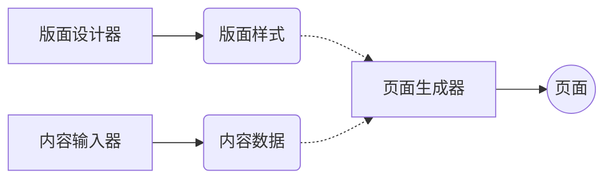
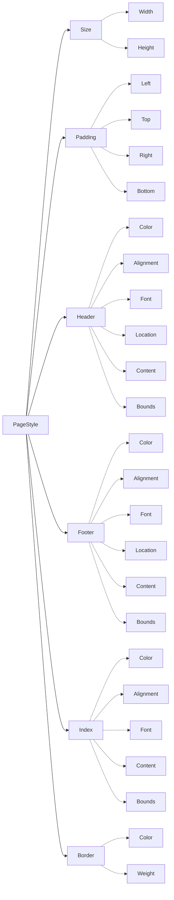

# 技术方案

## 技术难点

* 世系图生成算法
* 分页算法
* 版面设计器
* 页面生成器

## 思路

```mermaid
graph LR
PageStyleDesigner[版面设计器]-->PageStyle(版面样式)-.->PageGenerator[页面生成器]
ContentInput[内容输入器]-->PageContent(内容数据)-.->PageGenerator
PageGenerator-->Page((页面))
```

## 数据结构

```mermaid
graph LR
PageStyle-->Size
Size-.->Width
Size-.->Height

PageStyle-->Padding
Padding-.->Left
Padding-.->Top
Padding-.->Right
Padding-.->Bottom

PageStyle-->Header
Header-.->Header_Color[Color]
Header-.->Header_Alignment[Alignment]
Header-.->Header_Font[Font]
Header-.->Header_Location[Location]
Header-.->Header_Content[Content]
Header-.->Header_Bounds[Bounds]

PageStyle-->Footer
Footer-.->Footer_Color[Color]
Footer-.->Footer_Alignment[Alignment]
Footer-.->Footer_Font[Font]
Footer-.->Footer_Location[Location]
Footer-.->Footer_Content[Content]
Footer-.->Footer_Bounds[Bounds]

PageStyle-->Index
Index-.->Index_Color[Color]
Index-.->Index_Alignment[Alignment]
Index-.->Index_Font[Font]
Index-.->Index_Content[Content]
Index-.->Index_Bounds[Bounds]

PageStyle-->Border
Border-.->Border_Color[Color]
Border-.->Border_Weight[Weight]

```

