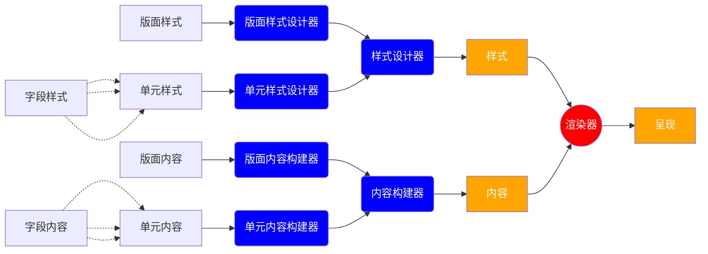
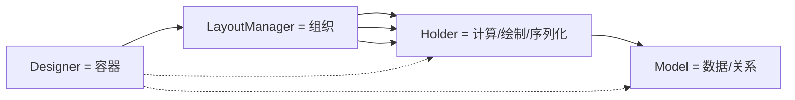
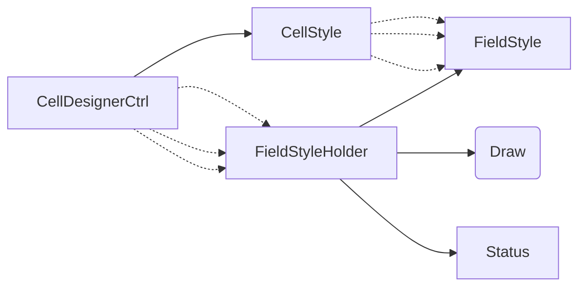
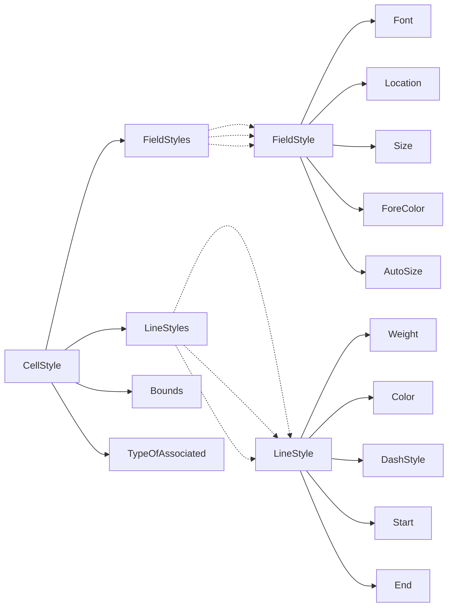

# 页面样式

## 思路

* 将页面分为背景和前景
* 背景有样式设计器产生
* 前景有内容决定

## ##  设计器

* Designer：界面容器
  * 工具条/状态条
  * 对象的属性编辑
  * 鼠标事件支持
  * 拖放事件支持
* LayoutManager：可视化的组织
  * 绘制方法的调用
  * 绘图板的缩放
  * 绘图板的平移
  * Holder对象的增加与移除
* Holder：各个单元的尺寸计算、绘制、序列化等
  * 状态的管理
  * 图形的绘制
  * 尺寸的计算
  * 与XmlNode之间转化（序列化）
* Model：数据与关系模型的表达

## 核心实体

## 基础函数库要支撑的业务点

1. 任意一段文字，指定宽度，全部显示，计算其所需高度
2. 任意一段文字，指定高度，全部显示，计算其所需宽度
3. 任意一段文字，指定宽度、高度，计算可显示的文字内容